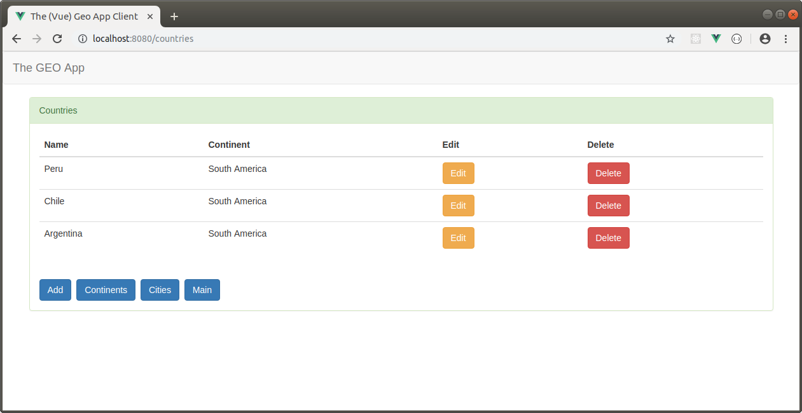

THE (VUE) GEO APP CLIENT
--------------------------------------------------------------------------------------------------------------------

Aplicación SPA desarrollada con Vue 3 que almacena información de continentes, países y ciudades.

La aplicación utiliza axios para conectarse a una API Rest desarrollada con Django Rest Framework 
y que permite almacenar la información en MongoDB.

**THE GEO REST API (DJANGO REST FRAMEWORK)**

https://github.com/edgar-code-repository/django-rest-geo-app

--------------------------------------------------------------------------------------------------------------------

Pantalla principal:

--------------------------------------------------------------------------------------------------------------------

Pantalla principal de CRUD de continentes:

--------------------------------------------------------------------------------------------------------------------

Pantalla principal de CRUD de paises:

--------------------------------------------------------------------------------------------------------------------

Pantalla principal de CRUD de ciudades:

